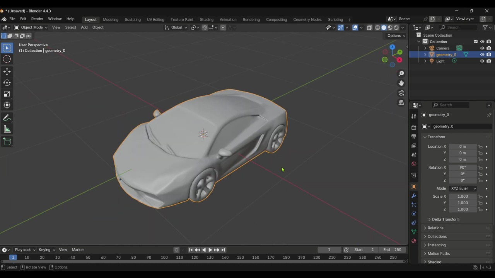

# CadGPT 🧠➡📦  
*Natural Language to 3D Model Generator*

CadGPT revolutionizes 3D modeling by enabling anyone to generate 3D models using simple text descriptions. No CAD experience or 3D modeling skills required — just type what you imagine, and let CadGPT bring it to life.

---

## 🚀 Features

- *🗣 Text-to-3D Modeling*: Describe what you want — CadGPT creates it.
- *🎨 Creative Freedom*: Focus on the idea, not the tools.
- *⚡ Rapid Prototyping*: Instantly visualize and iterate on concepts.
- *📚 Educational Use*: Learn and explore 3D concepts interactively.
- *🌐 Cross-Platform*: Use models in games, simulations, or 3D printing.

---

## 🏗 How It Works

1. *User Input*: Describe your desired 3D object in natural language.
2. *Text-to-Image*: The system leverages Stable Diffusion to create depth-aware 2D images.
3. *Depth Estimation*: A custom pipeline reconstructs 3D structure from 2D views.
4. *3D Reconstruction*: Generates a mesh using techniques like point clouds, smoothing, and surface reconstruction.

---

## 🛠 Tech Stack

- *Frontend/Server*: Flask  
- *Core ML*: PyTorch, Stable Diffusion  
- *3D Processing*: Open3D, Point_E  
- *Computer Vision*: OpenCV, NumPy  
- *Hardware Acceleration*: CUDA  
- *Language*: Python  

---

## ⚠ Challenges We Overcame

### 1. Memory Management
- Optimized GPU memory usage.
- Garbage collection and CUDA cache handling.
- Used efficient lightweight models.

### 2. 3D Reconstruction Quality
- Developed custom depth estimation with edge detection.
- Implemented mesh smoothing and Poisson reconstruction.

### 3. Performance Optimization
- Reduced inference steps.
- Streamlined point cloud and mesh processing.

---

## 📷 Visual Showcase

Here are some screenshots of the application in action:




---

## 📦 Installation

```bash
git clone https://github.com/kstij/CadGPT.git
cd CadGPT
pip install -r requirements.txt
python app.py


## 🎨 Example Prompts

Try these prompts to get started:

### Basic Shapes
- "a red cube"
- "a blue sphere"
- "a green pyramid"

### Objects
- "a wooden chair"
- "a coffee mug"
- "a vintage car"
- "a castle tower"

### Creative
- "a dragon"
- "a spaceship"
- "a robot"
- "a magical wand"


### Memory Requirements
- **Fast Mode**: ~2-4GB GPU memory
- **High Quality Mode**: ~6-8GB GPU memory


## 🐛 Troubleshooting

### Common Issues

1. **Out of Memory Error**
   - Use Fast mode instead of High Quality
   - Close other GPU-intensive applications
   - Restart the application

2. **Models Not Loading**
   - Check internet connection (models download automatically)
   - Ensure sufficient disk space (~2GB for models)

3. **Slow Generation**
   - This is normal for high-quality mode
   - Consider using Fast mode for quicker results

### System Requirements
- Python 3.8+
- CUDA-compatible GPU (optional, but recommended for GPU acceleration)
- 4GB+ RAM
- 3GB+ free disk space

## 📄 License

This project builds upon OpenAI's Point-E system. Please check the original Point-E license for usage terms.

## 🤝 Contributing

Feel free to submit issues and enhancement requests!

---

**Enjoy creating 3D models from your imagination! 🎨✨**s
